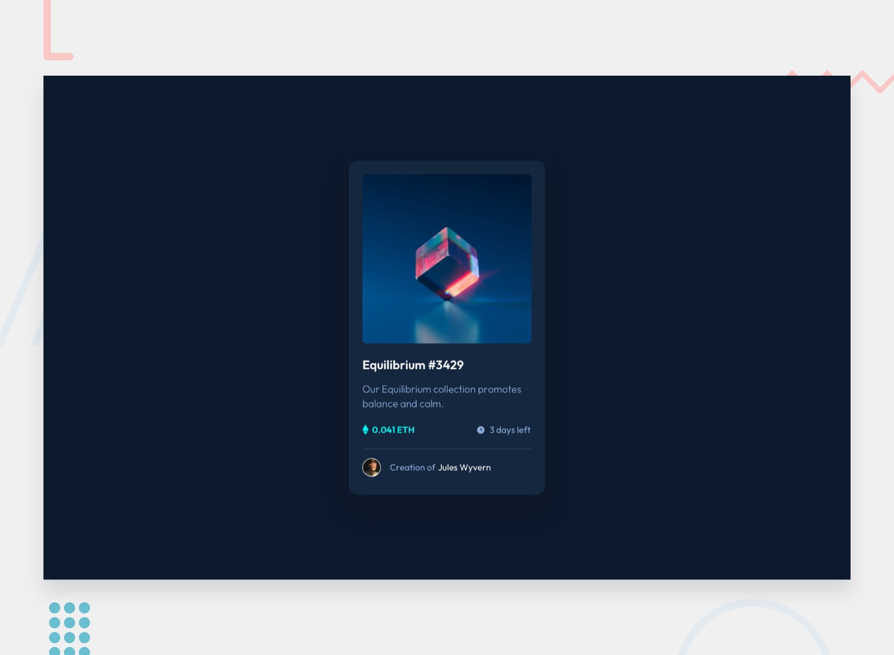

# Frontend Mentor - NFT preview card component solution

This is a solution to the [NFT preview card component challenge on Frontend Mentor](https://www.frontendmentor.io/challenges/nft-preview-card-component-SbdUL_w0U). Frontend Mentor challenges help you improve your coding skills by building realistic projects. 

## Table of contents

- [Overview](#overview)
  - [The challenge](#the-challenge)
  - [Screenshot](#screenshot)
  - [Links](#links)
- [My process](#my-process)
  - [Built with](#built-with)
- [Author](#author)

## Overview

### The challenge

Users should be able to:

- View the optimal layout for the app depending on their device's screen size
- See hover states for all interactive elements on the page
- Select and submit a number rating
- See the "Thank you" card state after submitting a rating

### Screenshot

### Links

- Live Site URL: [NFT Preview Card Component](https://nft-preview-card-component-trekab.netlify.app/)

## My process

### Built with

- React.js
- CSS custom properties

## Author

- Website - [Treasure Kabareebe](https://trekab.io/)
- Frontend Mentor - [@trekab](https://www.frontendmentor.io/profile/trekab)
- LinkedIn - [Treasure Kabareebe](https://www.linkedin.com/in/treasure-kabareebe/)
